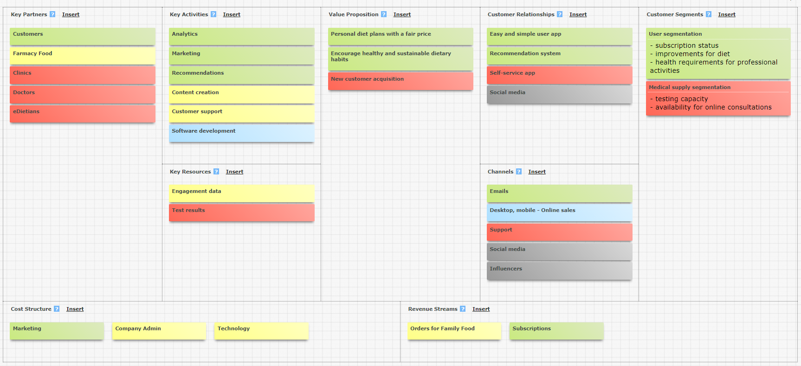
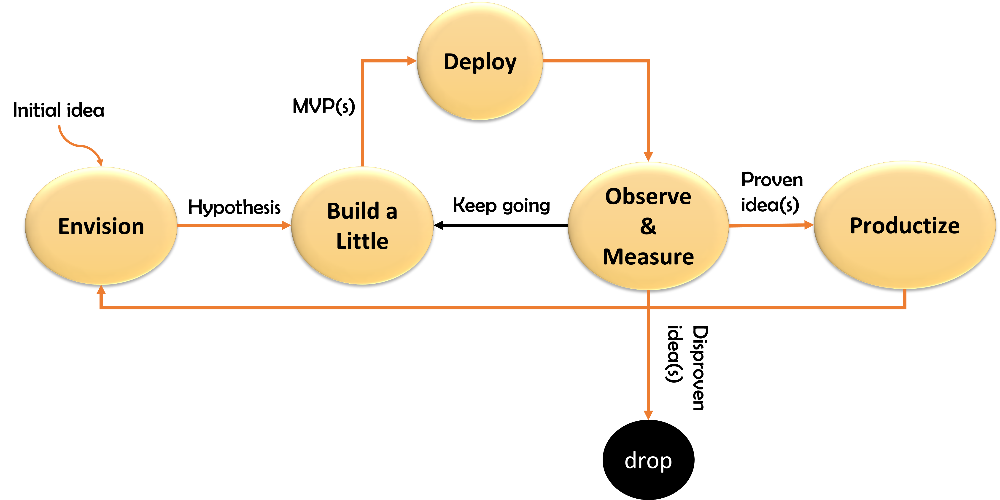

# Business Analysis and Solution Overview

## Mission and Vision Statement


> Farmacy Family is an enhancement of the existing [Farmacy Foods](https://www.farmacyfood.com/mission) system and was created with the spirit of making healthy food widely accessible and affordable by guiding a tighter engagement with customers and offering an AI-Based solution that drives personalized nutrition choices and recommendations.

- We aim at developing relationships between engaged customers and nurture those relationships
- We work hardly on converting transactional customers to engaged customers
- We generate analytical data from medical information to demonstrate the benefits of Farmacy Foods


> We want to spread happiness, promote equal opportunities of approaching healthy nutrition, enhance social experience, and contribute to spreading awareness.


## Product and Maret Assumptions

## Market Analysis

In order to assess **Market Opportunity**, primary and secondary research were conducted. Initial investigations suggest high profitability could be achieved by 
1. Resegmenting the existing market
2. Driving a successful model in another region. 

A Continuous Delivery Agile Life Cycle together with a well-established customer feedback loop will provide reasonable input to enhance initial market estimates. mainly: `TAM`, `SAM`, and `SOM`. [
[image source](https://upload.wikimedia.org/wikipedia/en/f/fd/TAM-SAM-Market.jpg) ]


## Lean Canvas

In order to visualize and understand various forces that drive our system, a `Business Model Canvas` was established. 



Motivated by the above diagram, and with the goal of understanding customers' pain and engaging their wishes, an initial lean version was constructed. it is to be continuously enhanced and updated based on feedback recieved. [ _`See MVP below`_ ]

For a clear identification of measurements that lead to valuable insignts and Key Performance indication `KPI`, _Vanity metrics_ were avoided and was replaced with _Actionable metrics_


[REF: online plotting tool](https://canvanizer.com/)
## MVP

Use customer feedback to develop/improve the product


# The Development Process in a Nutshell

## Exploratory Life Cycle [DA]

To establish sound bonds with various stakeholders, to encourage feedback and to understand customer needs, an `Exploratory Life Cycle` was constructed. Once completed, a `Continuous Delivery Lean Life Cycle` is to be followed for deploying the final solution.




## Solution Inception, Construction, and Transition

Details on the below processes are to be updated as the project progresses.

### The Inception Phase
<br>

>The goal is to get things running in the right direction. The process include:

```
1. Exploring Scoep
2. Identifying Architecture Strategy
3. Planning the Release
4. Developing a Test Strategy
```
### The Construction Phase
<br>

> The goal is to incrementally build a consumable solution and includ the following:
```
1. Proving Architecute Early
2. Addressing Changing Stakeholder Needs
3. Improving Quality
4. Accelerating Value Delivery
```

### The Transition Phase
<br>

> The final goal is to release the solution into production and include:

```
1. Ensuring Production Rediness
2. Deploying the Solution 
```
# Stakeholder and Communication Management
## Stakeholder Analysis

Various stakeholders are to be listed. Their `Power`, `Interest` and `Influence` is then to be analyzed to prepare a suitable engagement plan. The final objective is to maintain supportive and `less resistive` stakeholders

## Stakeholder Engagement Plan
<br>

The plan is to be updated shortly based on received feedback. Here are some samples:

> High power, high interested stakeholder --> `Manage Closely`.
- Fully engage in the development.
- Exert the greatest efforts to satisfy their requirements

> High power, less interested stakeholder --> `Keep Satisfied`

> Low power, interested stakeholder --> `Keep Informed`

> Low power, less interested stakeholder --> `Monitor`

## Communication Plan
<br>

`Underdevelopment`. Include frequency of communication, way of communication ... etc

## Personas
To understand the needs and without loss of generality, the following represent a sample usage of our system. User stories are listed under [Functional Requirements](FunctionalRequirements.md). `Check the next section`


[REF: utilized online tool](https://uxpressia.com/)


