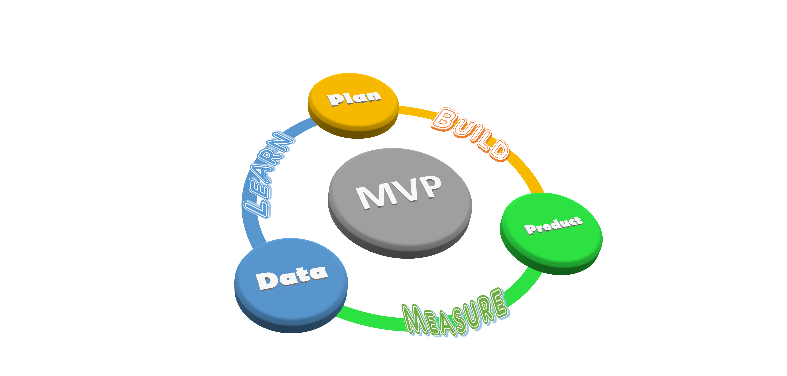

# berlin-bears
Architectural Katas -  Team 1 BERLIN BEARS


# Business Analysis

## Mission Statement

## Product Assumptions

## Market Analysis

In order to assess **Market Opportunity**,primary and secondary research were conducted. Initial investigations suggest high profitability could be achieved by 
1. Resegmenting the existing market
2. Driving a successful model in another region. 

A Continuous Delivery Agile Life Cycle together with a well-established customer feedback loop will provide reasonable input to enhance initial market estimates. mainly: `TAM`, `SAM`, and `SOM`. [
[image source](https://upload.wikimedia.org/wikipedia/en/f/fd/TAM-SAM-Market.jpg) ]


## User Stories


1. As <ins>a busy university student</ins>, I want to order a healthy meal anytime, so that I focus on my study
 
> `Main Feature`: **availability**. 
- The system shall enable online ordering (mobile phone, web interface, calling.. )
- The system shall offer delivery/pick up options 

2. As <ins>a working mother</ins>, I want to return the order and receive a new one easily and immediately if it does not meet my expectations , so that I keep up with my busy schedule

> `Main Feature`: **customer feedback**.
- The system shall enable flexible return of order items
- The system shall enable and gather feedback
- The system shall predict customer behavior 

3. As <ins>a fitness instructor</ins>, I want to flexibly preorder a healthy meal, so that I keep my busy schedule

> `Main Feature`: **preorder**.
- The system shall enable saving orders
- The system shall enable a scheduled delivery


4. As <ins>a local elementary classroom teacher</ins>, I want to place massive orders where I can selectively choose the gradients, so that  I can teach my students about healthy food in my cooking class

> `Main Feature`: **massive selected order**
- The system shall support multiple orders
- The system shall enable gradient selection

5. As <ins>a social media influencer</ins>, I want to take photo of the healthy meal, so that I can post it on my social media channel

> `Main Feature`: photo capture
- The system shall enable taking/storing/uploading images


6. As <ins>a busy worker</ins>, I don’t have time to browse the app and I want to record the order of my favorite healthy food on my way to work, so that I can focus on other tasks. 

>`Main Feature`: **voice recognition and processing**
- The system shall enable recording an order
- The system shall enable automatic processing and delivery

7. As <ins>a person with special dietary requirements</ins>, I want to be able to easily access the ingredients of my meal, so that I am maintaining my demands

> `Main Feature`: **data visualization**
- The system shall provide nice visualization on available gradients

8. As <ins>a healthcare professional</ins>, I want to be able to share feedback easily and provide system rating, so that deliver high quality recommendations to my patients 

> `Main Feature`: System evaluation
- The system shall easy rating mechanism
- The system shall provide accessible forms for feedback

9. As <ins>an investor</ins>, I want to see various statistics and analytics of how various stakeholders benefit from the system, so that I make a supporting decisions

> `Main Feature`: **Data Analytics**
- The system shall enable gathering data with customer consent and legal regulations
- The system shall provide smart predictive analytics 
- The system shall provide useful reports on history data

## Personas
[REF: utilized online tool](https://uxpressia.com/)

## Lean Canvas
[REF: utilized online tool](https://canvanizer.com/)

For a clear identification of measurements that lead to valuable insignts and Key Performance indication `KPI`, _Vanity metrics_ were avoided and was replaced with _Actionable metrics_


## MVP

Use customer feedback to develop/improve the product



## Solution Consideration Factors
- `Volatility`: ....
- `Uncertainty`: ...
- `Complexity`: ...
- `Ambiguity`: ...

## Stakeholder Management

...
### Stakeholder Analysis
...
### Stakeholder Engagement Plan
...

### Communication Plan
...
## User Stories
...
.....

## Life Cycle
 
## Exploratory Life Cycle [DA]


# Solution Inception
```
Get things running in the right direction
```

## Explore Scoep
...
- ## Identify Architecture Strategy
...
- ## Plan the Release
...
- ## Develop Test Strategy
...
# Solution Construction
```
Incrementally build a consumable solution
```
- ## Prove Architecute Early
...

- ## Address Changing Stakeholder Needs
...
- ## Improve Quality
...
- ## Accelerate Value Delivery
...
# Solution Transition
```
Release the solution into production
```
- ## Ensure Production Rediness
...

- ## Deploy the Solution

# References
- Fundamentals of Software Architecture. [link](https://learning.oreilly.com/library/view/fundamentals-of-software/9781492043447/)
- Building Microservices, 2nd Edition [link](https://www.amazon.de/Building-Microservices-Designing-Fine-Grained-Systems/dp/1492034029)
- Building Evolutionary Architectures [link](https://www.oreilly.com/library/view/building-evolutionary-architectures/9781491986356/)
- `PMBOK Guide`: A Guide to the Project Management Body of Knowledge [link](https://www.amazon.de/-/en/Project-Management-Institute/dp/1628251840)
- Choose Your WoW!: A Disciplined Agile Delivery Handbook for Optimizing Your Way of Working. [link](https://www.amazon.de/-/en/Scott-Ambler/dp/1790447844) 
- Business Model Generation: A Handbook for Visionaries, Game Changers, and Challengers Strategyzer. [link](https://www.amazon.de/-/en/Alexander-Osterwalder/dp/0470876417)
- The Business Model Book [link](https://www.amazon.com/Business-Model-Book-Design-business/dp/1292135700)
- 
